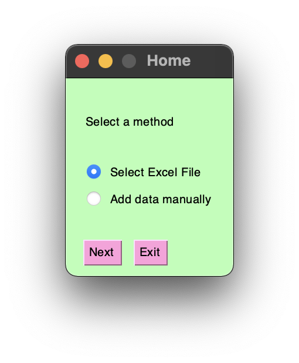
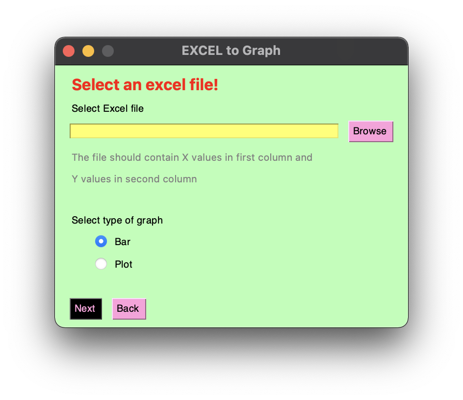
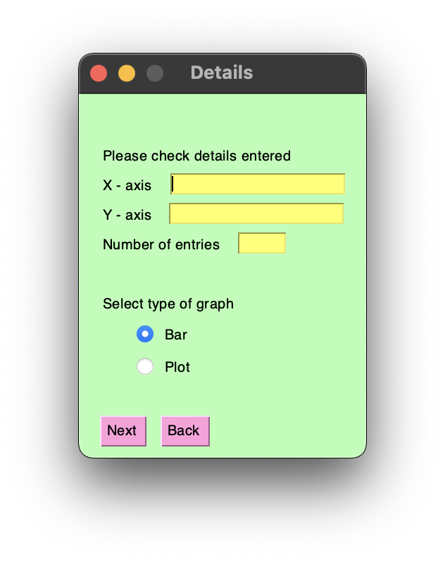

# Python-Graph
A graph plotting tool using Python with GUI. Create graph from manually input data or from Excel file 
# Requirments

Install all requirments after activating your vertual environment by running the comand

```
pip install -r requirements.txt
```

# Start App

Start app by running

```
python3 main.py
```

A window will pop up. Start using the app. 

<p align="left"></p>
<p align="left"></p>
<p align="left"></p>

- Feel free to send your feed back @ iahammedap@gmail.com
